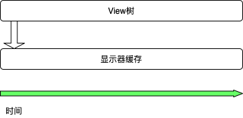

---
layout: post
title: "View刷新的几个问题"
excerpt: "基于问题驱动"
tags: 
- View
- Android
categories:
- Android
comments: true
share: true
---

咱们还是用问题来驱动吧！

**问：当用户打开一款App之后，停留在那个页面什么都不做，此时View是怎么刷新的?**

> Android中的代码都是通过消息驱动的，MainLooper中存储了UI线程所有要执行的消息。如果消息队列中已经没有消息了，那么线程会休眠，当新的消息来临时，UI线程会被唤醒去执行消息。如果用户_停留在那个页面什么也没做_，我们可以认为View树的数据没有更新，那么也就不会去重新measure,layout,draw了。但是屏幕是16ms刷新一次，所以屏幕刷新的是View树上一次的缓存数据。

<!---->

**问：App中的掉帧是什么原因？**

> 掉帧说的通俗点就是显示器输出的是上一次的数据，本来用户1s内可以看到24帧，可是由于某些原因，显示器缓存中的数据更新的次数<24，那么某些帧就被漏掉了。
>
>  假设app能保证在16ms之内完成View数据的计算并更新数据到缓冲区，在么在下一次更新信号来到的时候，用户看到的肯定是最新的内容了。
> 
> 结合Android中的相关api来具体分析一下：  
> `invalidate()`
> 
> 
> 
> 
> 